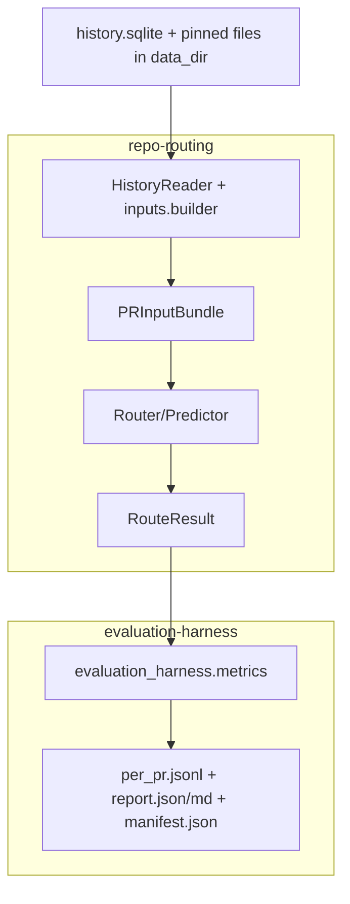

# Attention Routing Architecture

**Audience:** internal contributors extending `repo-routing` and `evaluation-harness`.

This document explains the current end-to-end architecture for leakage-safe, deterministic reviewer routing experiments.

---

## 1) Architecture overview

At a high level, the system evaluates:

`(repo, pr_number, cutoff) -> RouteResult`

with strict **as-of cutoff** constraints.



### Component map

- **Data substrate** (offline):
  - `data/github/<owner>/<repo>/history.sqlite`
  - pinned files like `codeowners/<base_sha>/CODEOWNERS`, `routing/area_overrides.json`
- **Core routing package:** `packages/repo-routing/src/repo_routing`
  - as-of reads: `history/reader.py`
  - canonical inputs: `inputs/models.py`, `inputs/builder.py`
  - routing contracts: `router/base.py`
  - predictor contracts/pipeline: `predictor/base.py`, `predictor/pipeline.py`
  - router registry/import loading: `registry.py`
  - deterministic artifact writer: `artifacts/writer.py`, `artifacts/paths.py`
- **Evaluation harness:** `packages/evaluation-harness/src/evaluation_harness`
  - run orchestration: `runner.py`
  - CLI: `cli/app.py`
  - cutoff policy: `cutoff.py`
  - truth labels: `truth.py`
  - metrics: `metrics/*.py`
  - outputs: `manifest.py`, `reporting/*`, `paths.py`

---

## 2) Data contracts

## 2.1 Raw sources (allowed)

Allowed for feature/input generation:

1. `history.sqlite` tables (including interval tables), and
2. deterministic pinned files in `data_dir` (for example CODEOWNERS at PR base SHA).

Disallowed in core routing/eval:

- network/API calls,
- reading mutable current repository checkout.

## 2.2 Canonical input bundle

`repo_routing.inputs.models.PRInputBundle` (`inputs/models.py`) is the canonical per-PR@cutoff input.

Built by:

- `repo_routing.inputs.builder.build_pr_input_bundle(...)` (`inputs/builder.py`)

Contains:

- identity: `repo`, `pr_number`, `cutoff`
- as-of snapshot: `snapshot` (`PullRequestSnapshot`)
- convenience fields: `changed_files`, `review_requests`, `author_login`, `title`, `body`
- parsed gate fields (`parse_gate_fields` output)
- computed areas (`area_for_path` + overrides)
- optional bounded `recent_activity`

## 2.3 Prediction contract

Output contract remains:

- `repo_routing.router.base.RouteResult`

with ranked `RouteCandidate`s and extensible `Evidence(kind, data)`.

Use `Evidence.data` for compact metadata (hashes, refs, model name). Store large payloads separately in artifacts.

---

## 3) Core abstractions and composition

## 3.1 Router abstraction (compatibility path)

- `repo_routing.router.base.Router`
  - `route(repo, pr_number, as_of, data_dir, top_k) -> RouteResult`

Builtins (currently wired):

- `mentions`, `popularity`, `codeowners`, `stewards`
- implemented in `router/baselines/*.py`, `router/stewards.py`

## 3.2 Predictor abstraction (feature-first path)

- `repo_routing.predictor.base.Predictor`
  - `predict(input: PRInputBundle, top_k) -> RouteResult`
- optional staging:
  - `FeatureExtractor.extract(input) -> dict[str, Any]`
  - `Ranker.rank(input, features, top_k) -> RouteResult`

Composition helper:

- `repo_routing.predictor.pipeline.PipelinePredictor`
  - with optional cache (`JsonFeatureCache`)

## 3.3 RouterSpec + loader

- `repo_routing.registry.RouterSpec`
- `repo_routing.registry.load_router(spec)`
- `repo_routing.registry.router_id_for_spec(spec)`
- `repo_routing.registry.PredictorRouterAdapter`

`RouterSpec.type`:

- `builtin` → name-based router
- `import_path` → `pkg.module:ClassOrFactory`

Import-path supports class or factory instantiation and optional `config_path`.

Router IDs:

- builtin: stable router name (`mentions`, ...)
- import-path: slugified import path + short hash of `(import_path + config hash)`

---

## 4) Evaluation flow (runner order)

Implemented in `evaluation_harness.runner.run_streaming_eval(...)`.

Per run:

1. Normalize router specs (`_normalize_router_specs`)
2. Resolve router IDs and load routers
3. Compute per-PR cutoffs (`cutoff_for_pr`)
4. Sort PRs by `(cutoff, pr_number)` for streaming order
5. For each PR:
   - build/write `snapshot.json`
   - build/write `inputs.json`
   - compute truth (`behavior_truth_first_eligible_review`)
   - compute gate metrics (`per_pr_gate_metrics`)
   - for each router:
     - run `router.route(...)`
     - write `routes/<router_id>.json`
     - if pipeline predictor features available, write `features/<router_id>.json`
     - compute routing and queue metrics
   - append one row to `per_pr.jsonl`
6. Aggregate summaries and write:
   - `report.json`, `report.md`
   - `manifest.json`

## Cutoff, truth, metrics

- cutoff policy: `evaluation_harness.cutoff.cutoff_for_pr`
  - supports `created_at`, `created_at+delta`, `ready_for_review`
- behavior truth: `evaluation_harness.truth.behavior_truth_first_eligible_review`
- routing metrics: `evaluation_harness.metrics.routing_agreement`
  - hit@1/hit@3/hit@5/MRR
- gate and queue summaries:
  - `metrics/gates.py`, `metrics/queue.py`

## Routers vs baselines compatibility

Current compatibility behavior:

- `per_pr.jsonl` writes both:
  - `routers` (preferred)
  - `baselines` (alias for backward compatibility)
- `report.json` and `manifest.json` include both `routers` and `baselines`
- `evaluation-harness explain` reads `routers` first, then falls back to `baselines`

---

## 5) Artifacts and directory layout

Root run dir:

- `data/github/<owner>/<repo>/eval/<run_id>/`

Key files:

- `manifest.json`
- `report.json`
- `report.md`
- `per_pr.jsonl`
- `prs/<pr>/snapshot.json`
- `prs/<pr>/inputs.json`
- `prs/<pr>/routes/<router_id>.json`
- optional `prs/<pr>/features/<router_id>.json`
- optional `prs/<pr>/llm/<router_id>/<step>.json`

Path helpers:

- `repo_routing.artifacts.paths`
- `evaluation_harness.paths`

Deterministic writes are centralized in `repo_routing.artifacts.writer._write_json_deterministic` and filesystem store JSON writers.

---

## 6) Feature engineering guide

## 6.1 Allowed feature sources

Use only:

1. `PRInputBundle` fields (preferred), and/or
2. direct SQL against `history.sqlite` with explicit time bounds (`<= cutoff`), and/or
3. pinned files in `data_dir` keyed by as-of identifiers (ex: `base_sha`).

## 6.2 Feature categories

### Candidate-level

- historical review/comment volume (windowed, recency-weighted)
- area/path affinity from prior participation
- author-candidate interaction history
- active load proxies

### PR-level

- changed file count/churn
- area breadth (`areas` count)
- parsed gate completeness
- explicit mentions/review requests

### Interaction features

- author affinity × area affinity
- confidence/risk adjustments
- request/mention agreement features

## 6.3 Leakage checklist

Before shipping a feature:

- [ ] Is every query/file read bounded by the PR cutoff?
- [ ] Are interval table semantics used correctly for as-of state?
- [ ] Does this avoid current checkout/network reads?
- [ ] If text is used, is it from as-of content intervals/snapshot?
- [ ] Is reviewer truth excluded from feature construction windows where needed?

## 6.4 Determinism checklist

- [ ] Stable sorting for sets/maps (logins, paths, areas)
- [ ] Stable JSON (`sort_keys=True`, fixed formatting)
- [ ] Stable router IDs (`router_id_for_spec`)
- [ ] Feature cache keys derived from deterministic serialized inputs
- [ ] No nondeterministic timestamps in model features/evidence

---

## 7) Extension playbooks

## 7.1 Add a new feature set (FeatureExtractor + Ranker)

1. Create extractor/ranker in your module:
   - implement `FeatureExtractor` and `Ranker`
2. Compose with `PipelinePredictor`
3. Wrap with `PredictorRouterAdapter`
4. Ensure evidence stores compact metadata; push large payloads to `llm/*` artifacts
5. Add tests:
   - deterministic feature output
   - cutoff safety (no post-cutoff access)
   - integration run emits `routes/*` and optional `features/*`

Implementation checklist:

- [ ] explicit input contract (`PRInputBundle` fields consumed)
- [ ] optional SQL bounded by cutoff
- [ ] deterministic sorting and serialization
- [ ] evidence payload bounded and hash-referenced

Evaluation checklist:

- [ ] compare against builtin baselines on same PR set
- [ ] inspect `per_pr.jsonl` for calibration and failure modes
- [ ] inspect report hit@k/MRR deltas and risk buckets

## 7.2 Add a new builtin router

1. Implement router class with `route(...) -> RouteResult`
   - suggested location: `packages/repo-routing/src/repo_routing/router/baselines/<name>.py`
2. Wire loader in `repo_routing.registry._builtin_router`
3. Add CLI validation entry in `evaluation_harness.cli.app` (`_VALID_ROUTERS`)
4. Add tests:
   - registry load test
   - eval runner artifact test
   - CLI validation test

## 7.3 Add a new import-path router

1. Implement class or factory in importable module:
   - returns object with `.route(...)` **or** `.predict(...)`
2. Invoke via `RouterSpec(type="import_path", import_path="pkg.mod:Factory")`
3. Pass config using `--router-config`
4. Verify router ID and artifact emission

Reference example:

- `packages/repo-routing/src/repo_routing/examples/llm_router_example.py`
- doc: `packages/repo-routing/docs/llm-import-path-router.md`

---

## 8) CLI usage examples

## 8.1 Builtin routers (modern flags)

```bash
evaluation-harness run \
  --repo acme/widgets \
  --data-dir data \
  --pr 101 --pr 102 \
  --router mentions \
  --router popularity
```

## 8.2 Import-path router with config

```bash
evaluation-harness run \
  --repo acme/widgets \
  --data-dir data \
  --pr 101 \
  --router-import repo_routing.examples.llm_router_example:create_router \
  --router-config config.json
```

## 8.3 Backward-compatible alias flags

```bash
evaluation-harness run \
  --repo acme/widgets \
  --pr 101 \
  --baseline mentions
```

## 8.4 Explain run output for one PR

```bash
evaluation-harness explain \
  --repo acme/widgets \
  --run-id <run_id> \
  --pr 101 \
  --router mentions
```

## 8.5 repo-routing single-router artifact build (legacy baseline flow)

```bash
repo-routing route \
  --repo acme/widgets \
  --pr-number 101 \
  --baseline mentions \
  --run-id debug-run \
  --as-of 2024-01-10T00:00:00Z
```

---

## 9) Troubleshooting and validation

Common errors:

- `unknown router(s)` / `unknown baseline(s)`:
  - check CLI names and spelling
- `--config is required when baseline includes stewards`:
  - provide `--router-config`/`--config` for stewards
- `invalid import_path (expected module:attr)`:
  - use `pkg.module:ClassOrFactory` format
- `missing issue_content_intervals` / `missing pull_request_head_intervals`:
  - ingestion intervals are required for strict as-of reads

Validation commands:

```bash
# fast targeted tests
./.venv/bin/pytest -q \
  packages/repo-routing/tests/test_registry_loading.py \
  packages/repo-routing/tests/test_inputs_bundle.py \
  packages/evaluation-harness/tests/test_runner_router_specs.py

# full package tests
./.venv/bin/pytest -q packages/repo-routing/tests packages/evaluation-harness/tests
```

Quick run sanity checks:

- confirm `prs/<pr>/inputs.json` exists
- confirm router-specific route files exist under `routes/`
- check `per_pr.jsonl` has `routers` key
- check `manifest.json` has router metadata (`router_id`, type, import_path, config hash)

---

## 10) Glossary

- **Router**: object implementing `route(...) -> RouteResult`
- **Predictor**: object implementing `predict(PRInputBundle, top_k) -> RouteResult`
- **FeatureExtractor**: stage producing structured features from PRInputBundle
- **Ranker**: stage converting `(input, features)` into ranked candidates
- **RouterSpec**: declarative router descriptor (`builtin` or `import_path`)
- **Router ID**: stable run key for router outputs and metrics
- **Baseline**: legacy name for builtin routers; now an alias to `routers`
- **Cutoff**: as-of timestamp defining what data is visible
- **Truth label**: observed target used for scoring (currently first eligible reviewer)
- **Deterministic artifact**: stable JSON output independent of execution order/environment

---

## Anti-patterns to avoid

- Feature extraction reading local git checkout files directly
- SQL queries without cutoff bounds for temporal features
- Writing unordered JSON/maps that vary run-to-run
- Storing massive LLM payloads directly in `Evidence.data`
- Coupling core `repo-routing` package to external networked LLM SDKs
