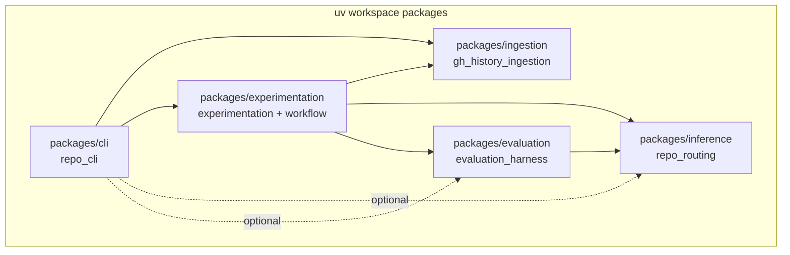
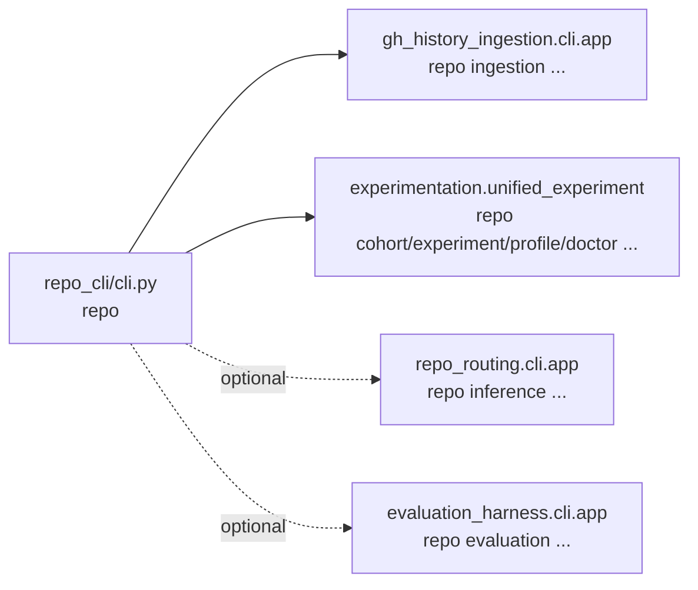

# Architecture

This repository is a local-first analytics + experimentation stack:

- Ingest GitHub repo history into a per-repo SQLite database.
- Build cutoff-safe PR snapshots / routing outputs, and optionally feature artifacts (when routers use `PipelinePredictor`).
- Evaluate routing agreement against truth policies with explicit coverage diagnostics.
- Drive everything through a unified CLI and experimentation workflows.

## System Context (Mermaid)

```mermaid
flowchart LR
  GH[GitHub REST API] --> ING[packages/ingestion\n"ingestion" CLI\ngh_history_ingestion]
  ING --> DB[(data/github/<owner>/<repo>/history.sqlite)]

  DB --> INF[packages/inference\n"inference" CLI\nrepo_routing]
  DB --> EVAL[packages/evaluation\n"evaluation" CLI\nevaluation_harness]

  INF --> BOUND[(boundary_model artifacts\n.../artifacts/routing/boundary_model/...)]
  DB --> PIN[(pinned repo artifacts\n.../repo_artifacts/<base_sha>/...)]
  PIN --> INF
  BOUND --> INF

  EVAL --> RUN[(eval run dir\n.../eval/<run_id>/)]
  RUN --> IDX[(examples_index.sqlite\n.../examples_index.sqlite)]

  RUN --> NOTE[notebooks/ + experiments/marimo\n(Marimo UIs, audits)]
  DB --> EXPX[experiments/extract/export_v0.py\n(SQLite -> Parquet)]
  EXPX --> PAR[(data/exports/<owner>/<repo>/<export_run_id>/*.parquet)]
  PAR --> NOTE

  CLI[packages/cli\n"repo" CLI\nrepo_cli] --> ING
  CLI --> EXP[packages/experimentation\ncohort/experiment/profile/doctor\nexperimentation]
  CLI -. optional mount .-> INF
  CLI -. optional mount .-> EVAL
  EXP --> EVAL
  EXP --> INF
  EXP --> ING
```

## Workspace Packages (Containers) {#workspace-packages-containers}



## Component Diagrams (By Package)

### Ingestion (`gh_history_ingestion`) {#ingestion-gh_history_ingestion}

Entrypoints:

- `packages/ingestion/src/gh_history_ingestion/cli/app.py` (`ingestion` console script)

```mermaid
flowchart LR
  CLI[cli/app.py\nTyper commands:\ningest|incremental|pull_requests|explore] --> GH[providers/github/*\nGitHubRestClient]
  CLI --> PIPE[ingest/*\nbackfill.py\nincremental.py\npull_requests.py]
  PIPE --> UPSERT[gh/storage/upsert.py\nupsert_* + insert_event]
  UPSERT --> ORM[storage/schema.py\nSQLAlchemy ORM]
  ORM --> DB[(history.sqlite)]
  PIPE --> INT[intervals/rebuild.py\nderive *intervals from events]
  INT --> DB
  CLI --> EXPL[explorer/server.py\nread-only sqlite explorer]
```

### Inference (`repo_routing`) {#inference-repo_routing}

Entrypoints:

- `packages/inference/src/repo_routing/cli/app.py` (`inference` console script)

```mermaid
flowchart LR
  CLI[cli/app.py\nTyper commands:\ninfo|snapshot|route|build-artifacts|boundary build] --> HR[history/reader.py\nHistoryReader strict as-of]
  HR --> DB[(history.sqlite)]

  CLI --> WR[artifacts/writer.py\nArtifactWriter]
  WR --> RUN[(.../eval/<run_id>/prs/<pr>/...)]

  CLI --> BPIPE[boundary/pipeline.py\nwrite_boundary_model_artifacts]
  BPIPE --> BART[(.../artifacts/routing/boundary_model/...)]

  ROUTERS[router/*\nmentions|popularity|codeowners|union|hybrid_ranker|llm_rerank|stewards] --> HR
  ROUTERS --> RUN
```

### Evaluation (`evaluation_harness`) {#evaluation-evaluation_harness}

Entrypoints:

- `packages/evaluation/src/evaluation_harness/cli/app.py` (`evaluation` console script)

```mermaid
flowchart LR
  CLI[cli/app.py\nTyper commands:\nrun|show|explain|compare|cutoff|sample] --> PREP[evaluation_harness/runner_prepare.py\ncutoffs + truth policies + leak guards]
  PREP --> PERPR[runner_per_pr.py\nper PR evaluation + artifact writes]
  PERPR --> ART[repo_routing.artifacts.writer\nPR snapshot/routes/features/llm steps]
  PERPR --> TRUTH[truth.py + truth_policy.py\nTruthDiagnostics + coverage]
  PERPR --> METRICS[metrics/*\nrouting_agreement|gates|queue]
  METRICS --> AGG[runner_aggregate.py\nrun-level aggregation + slices]
  AGG --> EMIT[runner_emit.py\nmanifest.json report.json report.md per_pr.jsonl]
  EMIT --> RUN[(.../eval/<run_id>/)]
```

### Experimentation (`experimentation`) {#experimentation-experimentation}

Entrypoints:

- Mounted under `repo experiment ...` by `packages/cli/src/repo_cli/cli.py`
- Main wiring: `packages/experimentation/src/experimentation/unified_experiment.py`

```mermaid
flowchart LR
  UX[unified_experiment.py\nTyper groups:\ncohort|experiment|profile|doctor] --> COH[workflow_cohort.py\ncohort.json + hash]
  UX --> SPEC[workflow_spec.py\nexperiment spec json + hash]
  UX --> RUN[workflow_run.py\nexperiment_run]

  RUN --> PREF[workflow_artifacts.py\nprefetch pinned artifacts (optional)]
  PREF --> PIN[(.../repo_artifacts/<base_sha>/...)]

  RUN --> EVALAPI[evaluation_harness.api.run]
  EVALAPI --> EVALDIR[(.../eval/<run_id>/)]

  RUN --> QUAL[workflow_quality.py\nquality gates + promotion eval]
  QUAL --> EVALDIR
  RUN --> SUM[workflow_summaries.py\nrun_summary.json + compare_summary.json]
  SUM --> IDX[examples_index.py\nexamples_index.sqlite]
```

### Unified CLI (`repo_cli`) {#unified-cli-repo_cli}

Entrypoint:

- `packages/cli/src/repo_cli/cli.py` (`repo` console script)


