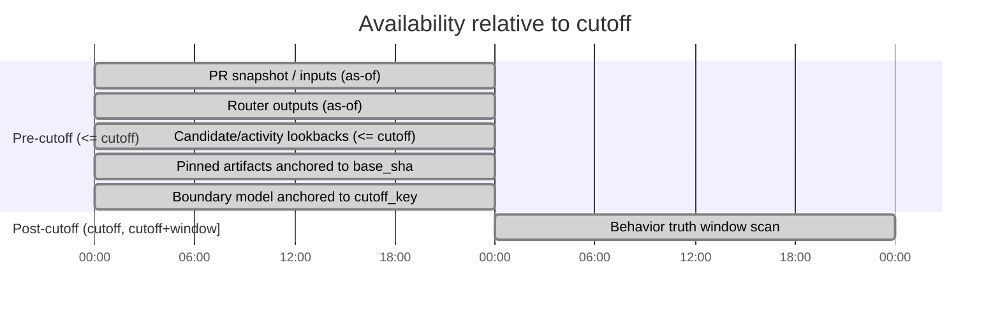

# Temporal Validity

Temporal validity is centered on a PR-specific cutoff timestamp (`cutoff`). The codebase uses explicit as-of reads, pinned artifacts, and coverage diagnostics to reduce leakage.

## Availability Timeline (Mermaid)

The chart is schematic: the system operates on real timestamps, but the key idea is "pre-cutoff inputs" vs "post-cutoff truth windows".

## Key Mechanisms

- As-of correctness:
  - `packages/inference/src/repo_routing/inputs/builder.py` uses `HistoryReader(..., strict_as_of=True)`.
- Pinned artifacts:
  - Resolved under `.../repo_artifacts/<base_sha>/...` via `repo_routing.repo_profile.storage.pinned_artifact_path`.
- Coverage-aware truth:
  - `packages/evaluation/src/evaluation_harness/truth.py` distinguishes unknown due to ingestion gaps from true negatives.
- Stale-cutoff guard:
  - `packages/evaluation/src/evaluation_harness/runner_prepare.py` aborts if `cutoff > db_max_event_occurred_at` when strict.

## Leakage Checklist

- Ensure every SQL query for feature inputs includes `<= cutoff` (or interval as-of joins) unless explicitly post-cutoff truth.
- Avoid reading mutable snapshot fields without an as-of anchor (prefer `events` / intervals).
- Never fetch CODEOWNERS/OWNERS from repo HEAD when building features; use pinned artifacts keyed by `base_sha`.
- Ensure evaluation truth windows are explicitly configured; task docs under `docs/attention-routing/tasks/` may describe different windows.
